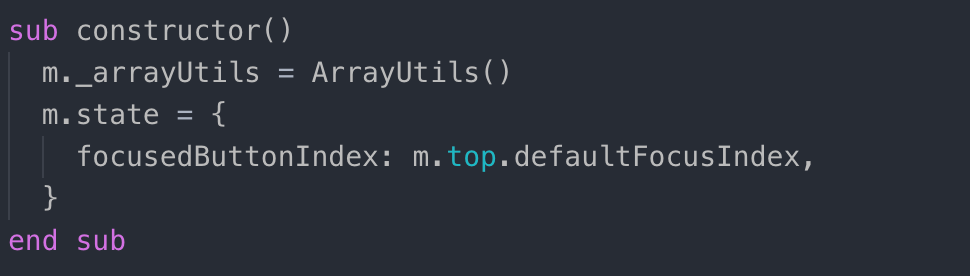
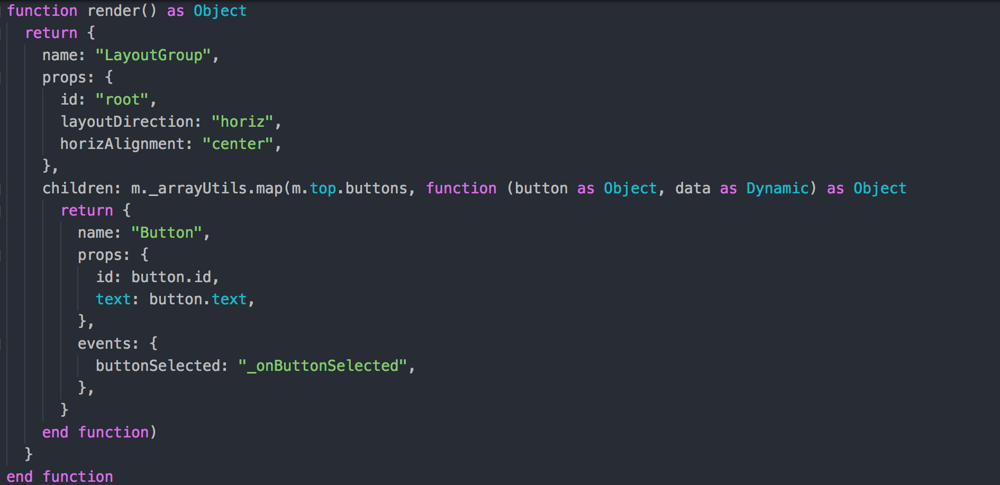
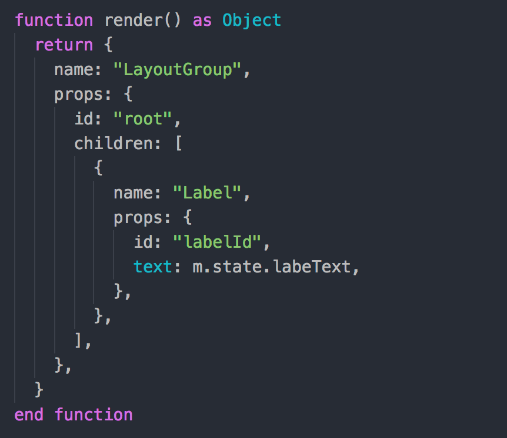
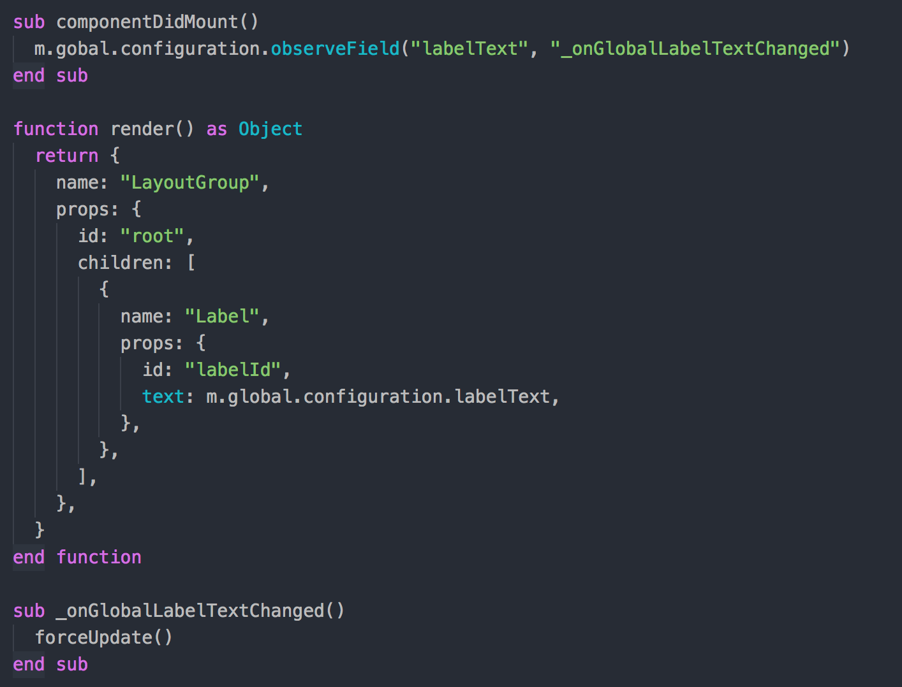
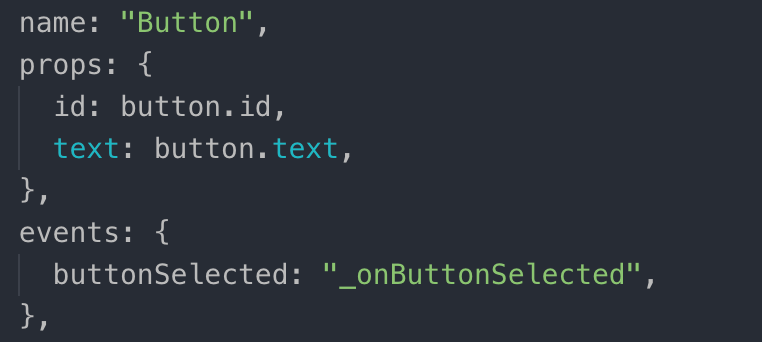

# Kopytko Framework

Kopytko Framework is a simple framework created to build simpler and cleaner components in Roku SceneGraph,
allowing you to write component code declaratively instead of imperatively, leading to a less error-prone codebase
and improving its maintainability overall. It is highly inspired by the Javascript library React and follows a lot
of its patterns as well as its API, making it extremely friendly for someone coming from a React components environment.
It is also inspired by router of the Javascript Angular framework and some other mechanisms taken from the Javascript world.

Kopytko Framework is part of Kopytko Roku Ecosystem which consists of:
- [Kopytko Framework](https://github.com/getndazn/kopytko-framework),
- [Kopytko Utils](https://github.com/getndazn/kopytko-utils) - a collection of modern utility functions for Brightscript applications,
- [Kopytko Packager](https://github.com/getndazn/kopytko-packager) - a package builder for the Roku platform,
- [Kopytko Unit Testing Framework](https://github.com/getndazn/kopytko-unit-testing-framework) - extended Roku's Unit Testing Framework with additional assert functionalities and the mocking mechanism,
- [Kopytko ESLint Plugin](https://github.com/getndazn/kopytko-eslint-plugin) - set of Brightscript rules for ESLint

Kopytko Framework, Utils and Unit Testing Framework are exportable as Kopytko Modules, so they can easily be installed
and used in apps configured by Kopytko Packager.

## Fundamentals
Kopytko components works almost as React components in terms of composition. They can have props to define its behaviour,
an internal state, life cycle methods, and data binding using something similar to React.createElement().

### Component creation
When manually creating a Kopytko component (in the Router or KopytkoDOM, for example), after using CreateObject()
to create the node, you should also call the initKopytko() interface method passing the component props (if any)
as a parameter. This method is responsible for the initialization of the component, which will eventually call its
constructor() and all of its other life cycle methods. It can also be used on tests to start the component with
new props and checking behaviour on methods like constructor() and componentDidMount().

### Constructor method
This is similar to every class based language's constructor() method. This is where you'll define the initial value
of the component state and any dependency it might need. It's called right after the component is created and all
of its props are set, that means you can use m.top inside this method to access all the props that were passed
to the component on its creation. You can see a simple example demonstrating the basic usage of the constructor() method
in the image below.



The main difference between constructor() and init() is that here you have access to the props that were set
in the component, where in init() you don't since it's called right after the node is instantiated.

### Render method
The render() method is the most important method in a Kopytko component and it must always be defined.
It must return an object following an element model which must have at least a `name` property containing
the name of the component to be rendered, additionally it can have a `props` property to define the fields
and custom props of this element, an `events` property to define callbacks to the component field changes,
and a `children` property which must be an array of this same object.
With this single object you can create a whole tree of elements defining dynamic values where needed.
You can see a simple example demonstrating the basic usage of the render() method in the image below.



Notice the usage of the array map utility function to create an array of dynamic elements based on the m.top.buttons props
that was passed by a parent component. You can do basically whatever you want in this object tree as long as you always
return an object with the element structure.

### Data binding and state management
Since to render an element you need to define it in an object, data binding is as simple as defining this object
with whatever data source you'd like and the element will be rendered with the passed data (different from XML where you
can only define static data). The "magic" comes when this data source is the component state (m.state)
or the component props (m.top.propName), because once this data changes (either by calling setState() or by a parent
component changing one of the component props), this change will be reflected on the DOM, updating it where needed
and refreshing the screen with the new data. This allows you to rather than imperatively changing an element's data
after something happens, you declaratively define that this element uses that data, updating it automatically when it's changed.

The initial state values can be (and should be) assigned directly only in the constructor. During the component's
life state should be updated by calling the setState() method.
Because children event listeners are set before the parent component is mounted, it is possible that setState() method
is called before the component was mounted. In such case, state update will be delayed right after
the componentDidMount lifecycle method call.

In the following image you can see the usage of the component state in the render() method.




Looking at this example, you can see that the text prop of the `Label` element is set to the labelText property
of the component state. The moment you call `setState({ labelText: "This text changed" })`, the label on the screen
will be updated to reflect this state change, so you don't need to directly find the label element and change its text,
everything is done automatically, the beauty of declarative programming. The same behaviour applies when using
component prop values instead of the state. In this example, text could be bound to something like m.top.labelText,
which is an interface field of the current component (a prop in Kopytko terminology), and the moment another parent
component change the value of this field the same DOM update would happen again.

### Force update method
The `forceUpdate()` method should be used when you need to use data from a source other than the component state or props.
For example, you can have a global configuration that you can use in the render() method to assign some value to some
element, but there's no way for Kopytko to know the source of this value and when it changes, so you can imperatively
tell Kopytko to force an update when you know the value changed, which will check the current DOM tree with the new one
(containing the updated global value now) and update the UI where needed. You can check the example in the following image
for a practical use case of this method.



See that all the function callback does is call `forceUpdate()`, which will cause Kopytko to run the `render()` function
again, this time getting the new value from m.global.configuration.labelText and applying the change later on.

### Element selectors
In the past we used to do something like `m.testLabel = m.top.findNode("testLabel")` in the `init()` method of every component
for every element we wanted to manipulate. With Kopytko there's no need for this process, all elements defined inside
the `render()` method will be assigned a reference in m with its ID passed in its props.
This means, of course, that you should always have a unique ID for every rendered element. It's also worth mentioning
that if you are conditionally rendering an element, when accessing m.elementId you must make sure that this element
actually exists at the time of its access, or it might cause an unexpected crash due to accessing properties on `Invalid`.

### Life cycle methods
During the life of a Kopytko component it will call some methods that can help you set hooks on some of Kopytko actions,
these methods are called life cycle methods and are: `constructor()`, `componentDidMount()`
and `componentDidUpdate(prevProps, prevState)`.

- `constructor()`
  The `constructor()` method is the first method called in a component life cycle. It is called right after the component
  props are all set and ready, that means you have access to all the component props inside this method using m.top,
  but the DOM tree is not mounted yet. This is where you should set the component initial state and external dependencies.

- `componentDidMount()`
  The `componentDidMount()` method is called right after the DOM tree is first mounted and displayed on the screen.
  It's the place where you can deal with elements as soon as they are ready and mounted, so it's safe to do things
  like handling focus, changing the state, etc. In the picture below you can see an example of using this method
  to handle the initial focus of a button group.

- `componentDidUpdate(prevProps, prevState)`
  The `componentDidUpdate()` method is called right after an update occurred in the DOM tree due to component state
  or prop changes. It will be called with the previous prop and state values as parameters, so you can use it to trigger
  some action in response to a new value as in the example below.

Remember that if you use `setState()` inside the `componentDidUpdate()` method it will cause it to eventually be called
again, which can lead to infinite loops, so make sure to wrap state changes in conditionals when setting it inside
this life cycle method.

## Basic Usage
In the following example you can see the basic markup XML of a Kopytko component:

```xml
<?xml version="1.0" encoding="utf-8" ?>

<component name="KopytkoButtonGroup" extends="KopytkoGroup">
  <interface>
    <!-- Props -->
    <field id="buttons" type="array" />
    <field id="defaultFocusIndex" type="integer" />

    <!-- Events -->
    <field id="buttonSelected" type="assocarray" alwaysNotify="true" />

    <!-- Functions -->
    <function name="focusButtonById" />
  </interface>

  <script type="text/brightscript" uri="KopytkoButtonGroup.template.brs" />
  <script type="text/brightscript" uri="KopytkoButtonGroup.component.brs" />
</component>
```

You can set `props` and `event` fields using the interface of the RSG component.

Every Kopytko component must extend from Kopytko and should not have any markup other than its interface to add
props and events. If you need to reuse code from another Kopytko component do not use inheritance, use composition.
You usually might want to use inheritance when you have "special cases" of a component, a button that is almost
the same as the button component but has some different colours for example, you can either achieve it by using
the same component in every place but with different colours passed as props, or you can create this special case
button component and instead of inheriting from the base button you just render the base button with the different
colours passed as props.

## Conventions
We need to maintain some conventions when creating Kopytko components in order to have a concise code that's predictable
and easy to maintain. For that reason we have some conventions that should be followed when creating such components.

### Template files
When creating the `render()` method to define the template of the component, this method should be isolated
in a template file. This file should follow the naming convention of `<ComponentName>.template.brs` and should be
imported in the component XML. This file should also contain any private method that creates elements, but nothing more
than that.

### Interface fields/props
When defining the component props in its interface, you should write <!-- Props --> on top of the prop fields
and <!-- Events --> on top of the event fields. This way you always know which fields should be used inside
the component as props and which should be manipulated and listened to outside the component as events.
You see check an example below.

```xml
<interface>
  <!-- Props -->
  <field id="buttons" type="array" />
  <field id="defaultFocusIndex" type="integer" />

  <!-- Events -->
  <field id="buttonSelected" type="assocarray" alwaysNotify="true" />
</interface>
```

### Event listeners
When you need to listen to events dispatched by a component (native or Kopytko), you should always use
the `events` field in the `render()` method to define listeners instead of explicitly listening to the field using
`observeFieldScoped()`. In the image below you can see how the `_onButtonSelected` function is being defined
as a callback to the `buttonSelected` event field of the `Button` component.




## Tests
You can easily test Kopytko components using the [Kopytko Unit Testing Framework](https://github.com/getndazn/kopytko-unit-testing-framework).
It is our modified version of the official brightscript testing framework provided by Roku.
Just make sure that your test component always extends the component you want to test.

### Initializing the component/initial props
Use `initKopytko(props)` to pass the initial props to the component and initialize it.
This method will probably be called in all of your tests to initialize the component. It will also call
life cycle methods as if the component was just created.

### KopytkoFrameworkTestSuite
Use `KopytkoFrameworkTestSuite` instead of basic Kopytko Unit Testing Framework's `KopytkoTestSuite`.
It will automatically clear your component state after every test case and make your unit tests independent.

### Checking element state after a rerender
Currently, there's no way to test asynchronous code in our test framework, and since changes that cause a rerender
are always done asynchronously, you can force a synchronous rerender using the `forceUpdate()` method, so when
you need to check if an element has some expected value after a rerender you can: change the desired prop,
call `forceUpdate()` to cause the rerender, and then check the element to see if it has the expected values.

### Using onKeyEvent() to fake remote key presses
When you need to assert something after some key was pressed, you can call directly the `onKeyEvent(press, key)` method,
which will call the method/execute the code related to the parameters you pass to it. Keep in mind that sometimes
this is not enough to fake a key press, take a button selected event as an example, when you press the OK key while
focusing a button the handler that handles this OK key press is set in the native Button component,
not in your component, so in such cases you should test the callback function directly (`_onButtonSelected()`, for example).

